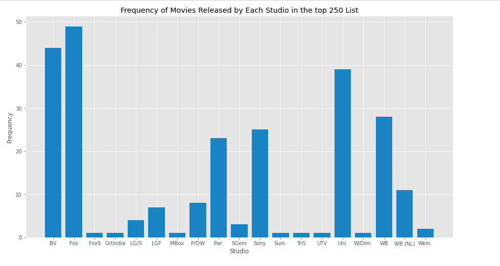

## Data Analysis for Microsoft Studios
Using data to drive strategic business decisions

### OVERVIEW
The objective was to examine data on movies to determine why they perform the way they do and recommend the best types of movies for Microsoft’s new studio to produce. The success of James Cameron’s Avatar movies shows that choosing the right types of films can bring in good results. Historical data on films can help determine what types of films to invest in.

### BUSINESS UNDERSTANDING
Producing profitable films is important for Microsoft’s new studio. It benefits shareholders, employees, and customers. Shareholders receive more profit, employees are paid well and customers are provided with consistently good films. Focusing on profitable film types is good for Microsoft.

### DATA UNDERSTANDING
#### Sources of Data
To understand the types of films the new Microsoft studio needs to produce, we first need to examine how the industry has perfomed, films that have performed well in the box office and their genres, and try to use statistical data to infer the reasons why they performed well and how that can be replicated by the studio.

I would say that the results are as good as the data used. In this analysis, we use data collected from the following sites:

* TheMovieDB
* The Numbers
* Box Office Mojo

#### Description of Data
We have three datasets obtained from the above sites for this analysis. The data sets are named tn.movie.budgets.csv (Obtained from the Numbers website), *bom.movie_gross.csv (obtained from Box Office Mojo website), and tmdb_movies.csv (obtained from TheMovieDB website).

The datasets are suitable for the analysis as they provide information on the following:

* Production budgets
* Movie genres,
* Gross earnings (both domestic and worldwide)
* Release Dates

The information helps us to understand movie performance, genres/combinations of genres that perform better in the box office, and whether production costs and release dates influence movie performance.

### DATA ANALYSIS AND VISUALIZATION
*Monthly Release Dates for the top 100 Movies*
 
The highest number of movies in the top 500 list were released in March and April, June and July, and September, October, and November, indicating that these months may be more profitable for movie releases. Other factors, such as weather, may also influence people to watch movies more during these months, particularly in June and July when many parts of the world experience colder climates.

*Studios with the Highest number of Movies in Top 250 List*
 
The chart compares the number of top 250 grossing movies released by different studios. Fox is the leading studio with 49 movies, followed by BV Pictures with 44 movies, Universal Studios with 39 movies, and WB, Sony, and Par. Pictures with 28, 25, and 23 movies respectively. These studios have successfully dominated the market and produced highly profitable films, making them valuable for Microsoft studios to learn from or partner with.

*Most Common Genres in Highest Grossing Films*
 
The horizontal bar chart shows that Adventure is the most common genre in the top 100 highest grossing movies, followed by Action, Fantasy, and Science Fiction. Focusing on these genres and combining them could provide a viable opportunity for capturing the global film market. 

### CONCLUSION AND RECOMMENDATIONSrgit update

The analysis shows a strong correlation between movie genre and performance as well as production studio and performance. 

The recommendation is for Microsoft to produce movies in the Adventure, Action, Fantasy, Science Fiction, and Comedy genres and partner with production studios such as Warner Bros, Fox, Universal Studios, and Walt Disney Studio Pictures. 

Production cost and release month are also factors to consider but of lower priority.
